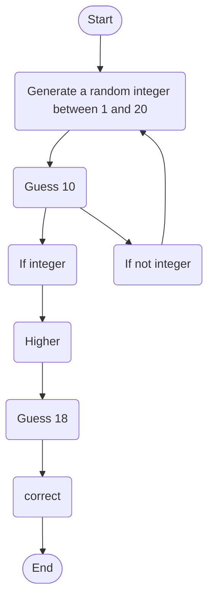

# **Guessing.md**
This is my lab guessing game using mermaid to show it works visually

The user starts the game and has to pick an integer that is between the numbers 1 and 20. If the user picks 10 the game continues. if they don't pick a number, the game will start over. If they guess a lower number they will have to pick a higher number. If they pick the right number they win and the game ends.  
